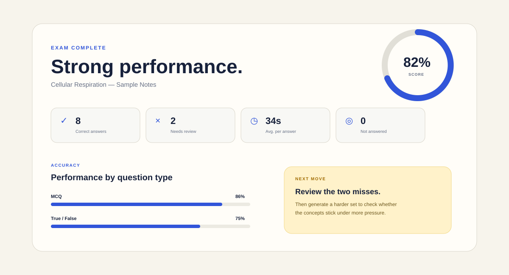

<div align="center">

# Smart Quiz Generator

### Turn lecture material into a focused practice exam.

**PDF or notes → custom questions → timed attempt → explanations → result analytics**

<br>


</div>

---

## A better way to revise from your own notes

Smart Quiz Generator turns the material you are already studying into an interactive exam session. Add a lecture PDF or paste your notes, choose the question style and difficulty, then work through a timed set built around the concepts in that material.

The experience is designed around active recall rather than passive rereading: answer a question, check the explanation, keep moving, then use the final report to see what needs another pass.

## Build the quiz you actually need

| Control | Options |
| --- | --- |
| **Material** | PDF upload, TXT/Markdown upload, or pasted lecture notes |
| **Question type** | MCQ, True/False, Short Question, Mixed |
| **Difficulty** | Easy, Medium, Hard |
| **Question count** | 3–20 questions |
| **Exam mode** | Live timer, progress tracking, instant checking |

## During the exam

Every practice set keeps the important information visible without crowding the question itself.

- **Live countdown** for the full attempt
- **Question progress** and quick navigation
- **Immediate answer checking**
- **Clear explanations** grounded in the supplied material
- **Reference answers** for short questions
- **Visible correct / review states** as the exam progresses

## Results that tell you what to do next



The result screen goes beyond a single percentage. It summarizes the session with:

- final score
- correct and incorrect answers
- unanswered questions
- average time per response
- accuracy by question type
- full answer review
- targeted revision guidance
- downloadable result report

## Four ways to practice

### Multiple Choice
Choose the statement that best matches the concept being tested. Useful for rapid revision and distinguishing similar ideas.

### True / False
Make a fast judgment on a statement drawn from the material, then check the explanation immediately.

### Short Question
Explain an idea in your own words. The response is checked against important concepts from the notes and paired with a reference answer.

### Mixed
Rotate between MCQ, True/False, and short-answer questions in one exam for a more varied revision session.

## Designed for real study sessions

Smart Quiz Generator works well with:

- lecture notes
- class handouts
- chapter summaries
- revision sheets
- study guides
- research notes
- course PDFs with selectable text

The built-in sample on cellular respiration makes it possible to explore the complete experience immediately.

## Exam flow

```text
Add lecture material
        ↓
Choose question type
        ↓
Set difficulty + question count
        ↓
Start timed practice exam
        ↓
Check answers + explanations
        ↓
Review score and performance
        ↓
Repeat with a new question set
```

## Notes on scoring

MCQ and True/False questions use exact answer checking. Short responses are evaluated against key concepts found in the source material, so concise wording can still receive credit even when it does not match the reference sentence word-for-word.

The score is intended as a revision signal rather than a formal academic grade.

## Repository description

> Practice exam generator that turns PDFs and lecture notes into timed quizzes with explanations, progress tracking and result analytics.

## Suggested topics

`education` · `quiz` · `exam-prep` · `study-tool` · `nextjs` · `typescript` · `pdf` · `active-recall` · `student-tools`

## License

MIT License.
