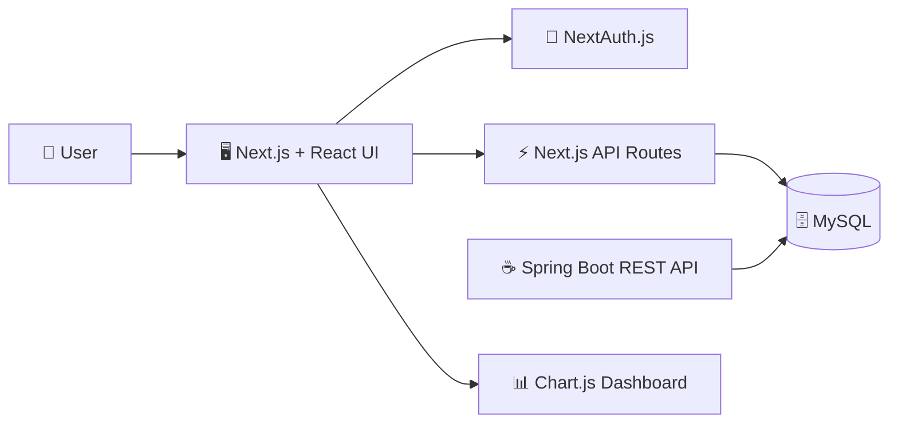
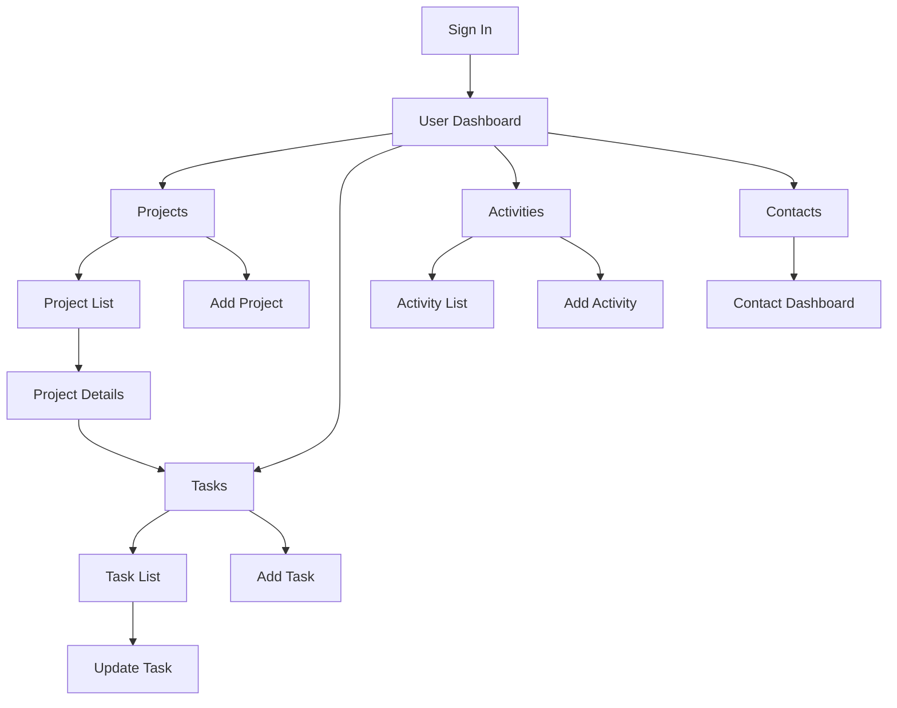

<a id="readme-top"></a>

<div align="center">

# 🚀 Project Management System

### Plan projects • Assign tasks • Track activities • Monitor progress

<p>
  
  
  
  
</p>

<p>
  
  
  
  
</p>

**A full-stack project tracking application for managing projects, phases, tasks, activities, contacts, and user dashboards from one place.**

[Features](#-features) · [Architecture](#-architecture) · [Setup](#-getting-started) · [Database](#-database-setup) · [Project Structure](#-project-structure)

</div>

---

## ✨ Features

<table>
<tr>
<td width="50%" valign="top">

### 📁 Project Management
- Create new projects
- View paginated project lists
- Open detailed project information
- Assign a project manager
- Track start, due, and completion dates
- View project phases

### ✅ Task Management
- Create and assign tasks
- Connect tasks to projects and phases
- Set estimated working hours
- Update task details and status
- Track start, due, and end dates
- Filter tasks by project

</td>
<td width="50%" valign="top">

### ⏱️ Activity Tracking
- Log work activities
- Connect activities to tasks
- Record worked date and duration
- View activity history
- Track who performed each activity

### 👥 Contacts & Dashboard
- Browse project contacts
- Open individual user dashboards
- View assigned projects and tasks
- Display weekly working hours
- Visualize hours with a doughnut chart

</td>
</tr>
</table>

### 🔐 Authentication & Access

- Credential-based authentication with **NextAuth.js**
- Custom sign-in page
- Session-aware navigation
- Restricted application pages for authenticated users
- User-specific dashboard data

---

## 🧰 Tech Stack

| Layer | Technology | Purpose |
|---|---|---|
| **Frontend** | Next.js 13, React 18 | UI, routing, server/client rendering |
| **Styling** | Bootstrap 5, React Bootstrap, Tailwind CSS | Responsive interface and layout |
| **Authentication** | NextAuth.js | Credential login and sessions |
| **Charts** | Chart.js, react-chartjs-2 | Dashboard visualization |
| **Date Handling** | Moment.js | Date formatting |
| **App API** | Next.js Route Handlers | Projects, tasks, activities, contacts, dashboard |
| **Database** | MySQL | Persistent project-management data |
| **Additional API Module** | Spring Boot, Java 17 | Separate REST API implementation included in `PMS_API` |
| **Build Tools** | npm, Maven | Frontend and Java dependency management |

---

## 🏗️ Architecture

The current web application uses **Next.js route handlers to communicate directly with MySQL**. The repository also contains a separate **Spring Boot REST API module** under `PMS_API/`.



> **Note:** The browser-facing application currently calls routes such as `/api/projects`, `/api/tasks`, `/api/activities`, `/api/contacts`, and `/api/userDashboard` inside the Next.js application.

---

## 🔄 Application Flow



---

## 📊 Main Modules

| Module | Available Functions |
|---|---|
| 🏠 **Dashboard** | Contact details, weekly hours chart, assigned projects, assigned tasks |
| 📁 **Projects** | Add, list, inspect details, show phases, filter related tasks |
| ✅ **Tasks** | Add, list, update, assign user, assign project/phase, manage status |
| ⏱️ **Activities** | Add work logs, list activities, record duration and worker |
| 👥 **Contacts** | Paginated contact list and contact-specific dashboard |
| 🔐 **Authentication** | Credential login, session handling, restricted pages, sign out |

---

## 🗄️ Database Model

The SQL scripts create the following core tables:

```text
Users
 └── Contacts
      ├── Projects
      │    ├── Phases
      │    ├── ProjectMembers
      │    └── Tasks
      │         └── Activities
      ├── Comments
      └── Documents

Statuses
ErrorLogs
```

The database scripts are available in:

```text
dbscripts/
├── CreateTables.sql
├── InsertRecord.sql
└── DateUpdateQuery.sql
```

`InsertRecord.sql` contains sample users, contacts, projects, phases, tasks, and activities so the interface can be tested with seeded data.

---

## 🚀 Getting Started

### Prerequisites

Make sure these are installed:

<p>
  
  
  
  
</p>

Java is only required if you want to run the separate `PMS_API` Spring Boot module.

### 1. Clone or extract the project

```bash
git clone <your-repository-url>
cd ProjectManagementSystem-main
```

If you downloaded the ZIP, extract it and open the project folder in your terminal.

### 2. Install frontend dependencies

```bash
npm install
```

### 3. Configure NextAuth

Create or update the root `.env` file:

```env
NEXTAUTH_URL=http://localhost:3000
NEXTAUTH_SECRET=replace-with-a-long-random-secret
```

You can generate a secret with:

```bash
openssl rand -base64 32
```

### 4. Configure the MySQL connection

The current project reads the MySQL connection from:

```text
src/app/api/services.js
```

Update the connection values for your local MySQL installation:

```js
var connection = await mysql.createConnection({
  host: 'localhost',
  user: 'YOUR_MYSQL_USER',
  password: 'YOUR_MYSQL_PASSWORD',
  database: 'projecttrackingsystem'
});
```

> 🔒 **Recommended:** Before deploying or publishing the project, move database credentials into environment variables instead of keeping passwords inside source files.

---

## 🛢️ Database Setup

### 1. Create the database

Open MySQL Workbench, phpMyAdmin, or the MySQL CLI and create/select the database expected by the application:

```sql
CREATE DATABASE projecttrackingsystem;
USE projecttrackingsystem;
```

### 2. Create tables

Run:

```text
dbscripts/CreateTables.sql
```

### 3. Insert sample data

Run:

```text
dbscripts/InsertRecord.sql
```

### 4. Optional date adjustment

The repository also contains:

```text
dbscripts/DateUpdateQuery.sql
```

Use it only when you need the provided sample dates adjusted.

---

## ▶️ Run the Next.js Application

Start the development server:

```bash
npm run dev
```

Then open:

```text
http://localhost:3000
```

Other available commands:

```bash
npm run build   # Create a production build
npm start       # Start the production server
npm run lint    # Run Next.js linting
```

---

## ☕ Run the Spring Boot API Module

The separate Java API lives inside:

```text
PMS_API/
```

It uses **Java 17**, **Spring Boot**, the **MySQL JDBC driver**, and **Maven Wrapper**.

### Windows

```bash
cd PMS_API
mvnw.cmd spring-boot:run
```

### macOS / Linux

```bash
cd PMS_API
./mvnw spring-boot:run
```

The Spring Boot module has controllers for:

```text
/api/projects
/api/tasks
/api/contacts
/api/errorLogs
```

> The Java module also contains its own database connection configuration in `PMS_API/src/main/java/com/PMS_API/DatabaseConnection.java`.

---

## 🧭 API Routes Used by the Web App

| Route | Main Purpose |
|---|---|
| `GET /api/projects` | List or retrieve project data |
| `POST /api/projects` | Create a project |
| `GET /api/tasks` | List or retrieve task data |
| `POST /api/tasks` | Create a task |
| `PUT /api/tasks` | Update a task |
| `GET /api/activities` | List activities |
| `POST /api/activities` | Add an activity |
| `GET /api/contacts` | List contacts |
| `GET /api/userDashboard` | Load user dashboard data |
| `/api/auth/[...nextauth]` | Authentication and session handling |

---

## 📂 Project Structure

```text
ProjectManagementSystem-main/
│
├── src/
│   └── app/
│       ├── (restrictedPages)/
│       │   ├── activities/
│       │   ├── contacts/
│       │   ├── projects/
│       │   ├── tasks/
│       │   └── user-dashboard/
│       │
│       ├── api/
│       │   ├── activities/
│       │   ├── auth/
│       │   ├── contacts/
│       │   ├── projects/
│       │   ├── tasks/
│       │   ├── userDashboard/
│       │   └── services.js
│       │
│       ├── components/
│       │   ├── charts/
│       │   ├── globalBar.js
│       │   ├── loading.js
│       │   └── pagination.js
│       │
│       ├── login/
│       ├── globals.css
│       ├── layout.js
│       └── page.js
│
├── PMS_API/
│   ├── src/main/java/com/PMS_API/
│   │   ├── ProjectsController.java
│   │   ├── TasksController.java
│   │   ├── ContactsController.java
│   │   ├── ErrorLogController.java
│   │   └── DatabaseConnection.java
│   └── pom.xml
│
├── dbscripts/
│   ├── CreateTables.sql
│   ├── InsertRecord.sql
│   └── DateUpdateQuery.sql
│
├── .env
├── package.json
├── next.config.js
├── tailwind.config.js
└── README.md
```

---

## 🔐 Security Notes

> [!IMPORTANT]
> The current source contains development-style database/authentication code. Before using the application in production, harden these areas.

- Move all database usernames and passwords to `.env` variables.
- Do not commit `.env` files containing secrets.
- Hash user passwords with a secure password-hashing algorithm such as **bcrypt** or **Argon2**.
- Replace string-concatenated SQL queries with **parameterized queries / prepared statements**.
- Validate and sanitize user-submitted data on the server.
- Use a strong `NEXTAUTH_SECRET` in production.
- Change/remove sample account credentials before deployment.
- Restrict database permissions to the minimum required by the application.

---

## 🎯 Suggested Improvements

- [ ] Add project editing and archiving
- [ ] Add task deletion with confirmation
- [ ] Add role-based permissions for administrators, managers, and members
- [ ] Add search and advanced filtering
- [ ] Add project progress charts
- [ ] Add deadlines and overdue-task indicators
- [ ] Add comments and document upload UI
- [ ] Add password hashing and secure database queries
- [ ] Move database configuration fully to environment variables
- [ ] Add automated tests and CI/CD
- [ ] Connect the web frontend to one consistent API layer

---

## 🧪 Sample Data

The supplied SQL seed file provides example:

- users and contacts
- project managers and project members
- projects and phases
- tasks with statuses and estimates
- work activities and durations
- color-coded statuses

This makes it possible to populate the system quickly for development and demonstration.

---

## 🤝 Contributing

Contributions can follow a simple workflow:

```bash
git checkout -b feature/your-feature
git add .
git commit -m "Add your feature"
git push origin feature/your-feature
```

Then open a pull request describing what changed and how it was tested.

---

<div align="center">

### 💼 Build projects. Organize work. Track progress.


<br/><br/>

[⬆ Back to top](#readme-top)

</div>
